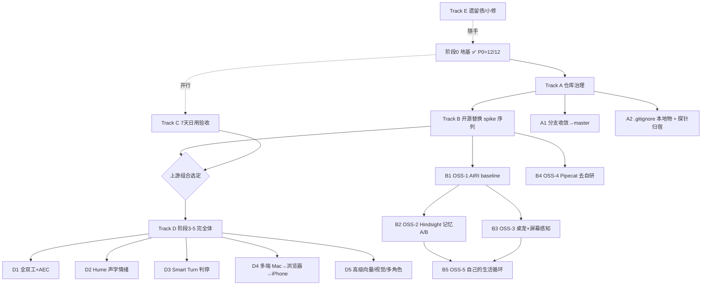

# 项目剩余路线图（2026-06-29 起，向前看的唯一任务地图）

> 这份文档回答三个问题：**现在在整体项目的什么位置 / 还剩哪些任务 / 按什么顺序展开。**
> 规则：每个任务都切到 **Sonnet 4.6 可独立执行**的粒度（有 scope / 读取文件 / 验收 / 产出）。
> 与 `docs/MVP_STATUS.md`（记分牌）、`docs/TASK_QUEUE.md`（历史轮次日志）、
> `docs/NEAREST_NEIGHBOR_AUDIT_2026-06-29.md`（替换证据）配合；冲突以本文件 + 代码为准。
> 角色分工：Opus（总工程师）负责拆解/架构/审 diff/判断进入下一步；Sonnet 负责按任务落地实现。

---

## 0. 现在在哪 —— 一句话

**地基已完工（阶段 0：P0 = 12/12，健康度全绿，736+tsc 绿）。P1 大部分也已落地。**
项目正站在**阶段 1「上游重置」的入口**：2026-06-29 路线重置把"自己继续写 P2"改成
"**先跑开源原版做 A/B，证明更强且机器能扛才替换**"，最终形态 = **Boxi 薄层（身份/关系数据/
真实性原则/Shared Soul/显式权限）+ 每个模块实测最强的上游**。

### P0/P1/P2 现状对照（北极星 = `_audit/TARGET.md`）

| 层 | 能力 | 现状 |
|---|---|---|
| P0 | 人格/文字/记忆/诚实/情绪关系/行为决策/主动/Shared Soul/语音/持久化/安全成本/可维护 | ✅ 12/12 |
| P1 | 流式 STT | ✅ Pipecat 豆包 STT |
| P1 | 流式 TTS | ✅ Fish streaming |
| P1 | 可打断 + 语义判停 | 🟡 半双工；打断/AEC 归阶段 3 epic |
| P1 | 情绪→声音表达映射 | ✅ tagger（用户听感验收保留） |
| P1 | idle experience | ✅ P9-P2 |
| P1 | 记忆纠正/删除/导出 + 反思 | 🟡 update/delete + reflection 有；**导出未做** |
| P1 | 多语言显示（中英日） | ✅ P11 |
| P2 | 全双工+AEC / Hume / Smart Turn / 多端 / 高级视觉 / 多角色 | ❌ 阶段 3–5，未开 |

> ⚠️ **TARGET.md 待对齐**：其 P0 仍写「主动陪伴有冷却期/每日上限/忽略后提频」，已被
> 2026-06-29 doctrine 删除。见任务 **E5**。

---

## 1. 依赖地图（一眼看懂顺序）

**关键顺序**：A（治理）→ B（替换 spike，**冻结新自研**期间的主线）；C（7 天验收）与 B 并行，
作为 MVP 回滚基线；B 的结论选定上游组合后才进 D（阶段 3–5）。E 是低优先小修，随时插空。

---

## Track A · 仓库治理（最先做，解锁一切）

### A1 · 分支收敛到 master
- **背景**：master 与 `codex/voice-stabilization-20260627` 已分叉（master +50 / 本分支 +37），
  且本地有 `codex/soul-runtime` `codex/product-integration-20260627` `codex/chief-engineer-workflow`
  等并存。本轮 4 个路线重置 commit（`2dacd28`/`e36847d`/`1016af8`/`ef6944a`）落在 voice 分支，未进 master。
- **Scope**：先 `git log --oneline master..<each-branch>` 与反向，列出每条分支独有 commit 的主题；
  判定哪条是 canonical 主线；把路线重置 + soul-runtime 必要成果合并/rebase 到 master；删废弃分支。
- **禁止**：force-push 已发布历史（仓库 public，见 memory `cyber-companion-public-repo`）；丢任何 soul-runtime Phase 成果。
- **验收**：master 包含全部当前生效代码，`npm run check` 绿；废弃分支清理；远端与本地一致。
- **产出**：一张分支处置表（保留/合并/删除）+ 收敛后的单一主线。**这是 Opus 先决策、Sonnet 执行的任务。**

### A2 · 本地物归位 + 探针归宿
- **Scope**：把长期保持本地的 `experiments/` `data/` `.mcp.json` `.cursor/mcp.json` `.cursor/skills/`
  `.agents/` 加进 `.gitignore`（消除 `git status` 噪音）；决定 `run_voice.py` 的 `_LatencySpikeLogger`
  探针归宿（删除 / 或挪到 `experiments/` 并加 env 开关，不留在生产入口）。
- **验收**：`git status` 干净（无未跟踪噪音）；`run_voice.py` 生产路径不含一次性探针；测试绿。
- **产出**：干净工作树。small diff。

---

## Track B · 开源替换 spike 序列（doctrine 主线 · 期间冻结新自研）

> 通则：每个 spike **隔离目录**运行，用现有云 provider，**禁止**先改 canonical 生产代码/用户数据。
> 每个都必须产出 **whole-base / 嫁接 packages / reject** 三选一结论 + 资源数据 + 能力 A/B + 迁移&回滚方案。
> 不能以"架构不同"拒绝。证据写回各自 `docs/OSS_SPIKE_*.md`。

### B1 · P0-OSS-1：AIRI 未修改 baseline（**B 序列第一个，下一个实际动手任务**）
- **读**：`docs/NEAREST_NEIGHBOR_AUDIT_2026-06-29.md` §五.2 + AIRI releases 页。
- **做法**：隔离目录跑官方 macOS **x64** release；接现有云 provider 跑文字/语音/桌面角色；
  **关闭**本地大模型、游戏 agent、重视觉。
- **测量**：冷启动时间；常驻/对话/语音三态下 CPU 与 RAM；首 token / 首音频延迟；Intel 兼容问题；
  可独立复用的 packages（stage/desktop/perception）。
- **验收**：`docs/OSS_SPIKE_AIRI.md` 给出三选一结论 + 上述数据表 + 回答 Open Question #1（packages 能否
  脱离其前端独立复用）。
- **粒度提示给 Sonnet**：B1 可拆 B1a（下载+隔离跑通+冷启动/常驻资源）、B1b（接云 provider 跑三模态+延迟）、
  B1c（packages 复用性评估+结论）。

### B2 · P0-OSS-2：Hindsight 记忆库替换 A/B
- **前置**：B1 完成（确认整机资源画像）+ Open Question #3（导出当前真实 SQLite 关系事实清单）。
- **Scope**：独立 DB/服务 + adapter + 固定 Boxi 中文 fixture；**不先改 canonical SQLite**。
- **A/B 维度**：中文单跳 / 多跳 / 时间矛盾 / 关系变化 / 跨日召回 / retain 峰值 RAM / recall p50/p95 / API 成本。
- **验收**：`docs/OSS_SPIKE_HINDSIGHT.md`；若能力领先且机器可承受，设计**一次性**迁移并删旧检索/反思主线
  （禁长期双栈）；否则 reject 并记录原因。
- **Sonnet 拆**：B2a（fixture 生成 + Boxi 真实数据导出）、B2b（Hindsight 隔离部署 + adapter）、
  B2c（跑 A/B + 资源测量 + 结论 + 迁移/回滚设计）。

### B3 · P0-OSS-3：具身（Open-LLM-VTuber）+ 屏幕感知（screenpipe）评估
- **前置**：B1（AIRI 可能已覆盖部分具身，先看 B1 结论是否让 B3 缩小范围）。
- **Scope①具身**：评 Open-LLM-VTuber 的透明置顶桌宠 / Live2D-VRM / 触摸 / 表情映射 / Agent 接口；
  不重写同类桌面基础设施；像素 UI 仅作审美选项保留。注意 Open Question #5（Live2D 资产许可证与 Boxi 资产分离）。
- **Scope②感知**：screenpipe 只启 **accessibility + app/window event**，**禁** 24/7 音频、本地 Whisper、高频 OCR；
  在这台 2019 Intel Mac 实测 CPU/磁盘后再决定是否常驻（Open Question #4）。
- **验收**：`docs/OSS_SPIKE_EMBODIMENT_PERCEPTION.md`，分别给具身/感知的采用结论 + 资源实测 + 许可证处置。

### B4 · P0-OSS-4：Pipecat 去自研化审计
- **Scope**：逐项对照官方 Fish service / Mem0 integration / transport / smart-turn / voice-ui-kit，
  审 `backend/realtime/` 每个自定义 voice service / pipeline_router / turn handling / 前端 voice UI；
  **上游能替代的就删**，不能替代的写明理由；**Shared Soul processor 必须保留**。
- **验收**：`docs/OSS_SPIKE_PIPECAT_THINNING.md` 列出每个自定义层的 保留/替换 决定 + 替换后测试绿。
- **note**：与 B1/B2 无强依赖，可在 B 序列任意空档插入；但替换 transport 会牵动 D4（多端音频），建议在 D4 前。

### B5 · P0-OSS-5：单角色「自己的生活」循环
- **前置**：B2（记忆层选定，life loop 的状态要落在最终记忆系统上）+ B3（感知可作 life loop 输入）。
- **Scope**：适配 genagents / AI Town 的 planning/reflection/simulation loop，**只跑一个角色 + 云 LLM 低频**；
  **禁**本机多 agent 重负载。状态本地持久化。
- **验收**：跨日**计划/经历/未完成目标连续**（不是随机生成几条 idle 文本）；回答 Open Question #6
  （产生可感知但不胡写的生活连续性所需的最低云调用频率）。`docs/OSS_SPIKE_OWN_LIFE.md`。

---

## Track C · 7 天日用验收（与 B 并行，验证 MVP 作为回滚基线成立）

### C1 · 连续 7 天验收
- **读**：`docs/MVP_DAILY_ACCEPTANCE.md`（Day 1 = 2026-06-28，进行中）。
- **8 条门槛**：每天文字+语音；重启后人格/关系/记忆连续；正确召回数个跨天事件；≥1 次基于真实
  open loop 的主动交流；不需开终端修状态；无频繁回声自触发；无明显人格漂移/虚构记忆；云失败不破坏本地数据。
- **Sonnet 职责**：每天追加一行证据到 `MVP_DAILY_ACCEPTANCE.md`，撞到 bug 记录到 Track E 而非当场大改。
- **验收**：8 条连续 7 天全绿 → MVP 正式成立（同时保留为上游替换的回滚基线）。

---

## Track D · 阶段 3–5 完全体（上游组合选定后才开；**禁止提前碰全双工**）

> 这层对应 TARGET P2。**只有 Track B 选定上游 + Track C 验收通过后**才进入。
> 进入时每个 D 任务要按当时选定的上游重新精拆（接口会变）。这里只立条目与依赖。

- **D1 · 全双工 + AEC**（阶段 3）：外放环境回声消除 + 真打断。核心是 AEC（浏览器/WebRTC 白送），
  非换 ASR（见 memory `voice-bargein-needs-aec`）。依赖 D4 的浏览器原生音频传输或 WebRTC transport（B4）。
- **D2 · Hume 声学情绪**（阶段 3）：只取 measurement API 当**传感器**，off-path 旁路喂 kernel，
  绝不用 EVI 整套替换 soul（见旧 P12 立项）。
- **D3 · Smart Turn 高级语义判停**（阶段 3）：接 Pipecat smart-turn（B4 已评估）。
- **D4 · 多端**（阶段 4）：Mac 桌面封装 → 浏览器原生音频传输（当前是后端 LocalAudioTransport 连本机麦/扬）
  → iPhone 原生。Shared Soul 已是后端单一内核，多端只接表面。
- **D5 · 能力完全体**（阶段 5）：高级向量库 / 摄像头视觉 / 麦克风阵列·硬件 AEC / 多角色。多为换硬件后再做。

---

## Track E · 遗留债与小修（低优先，随时插空，small diff）

- **E1 · 单字尾音自回声**：代码+回归已完成；日常真机若再现尾字回收，只记录 ASR final + `BotStopped` 相对时间，
  确认日志 `self-echo suppressed`；不盲目放宽单字匹配。真治在 D1 的 AEC。
- **E2 · 记忆导出**（P1 缺口）：补 `/memory/export`（用户可导出记忆）；TARGET P1 明列、当前未做。small。
- **E3 · 日语 Fish 音色按语言切换**：清单已在 memory `fish-audio-ja-voice-shortlist`，后端未接按语言切音色。
- **E4 · Fish WS 空闲断连 / 沿用未完成项**：P9-P2-C（真联网素材源）、P9-D（投递层 epic）按需。
- **E5 · TARGET.md 对齐**：把 P0「主动陪伴…冷却期/每日上限/忽略后提频」改为符合 2026-06-29 doctrine
  的无节流措辞（注脚说明被 reset 取代）。doc-only。
- **E6 · 文档去重**：仓库 60+ 文档大多是历史；按 `MVP_STATUS.md §F` 把 ⚪ 历史档统一标注，减少新 session 跑偏。

---

## 下一个实际动手任务

**A1（分支收敛）+ A2（本地物归位）→ 然后 B1（AIRI baseline）。**
A 先做是因为：当前 4 个路线重置 commit 还困在 voice 分支、master 已分叉，不收敛会让后续所有 spike 的基线不清。
A 由 Opus 决策分支处置表后交 Sonnet 执行；B1 起进入 spike 节奏。
